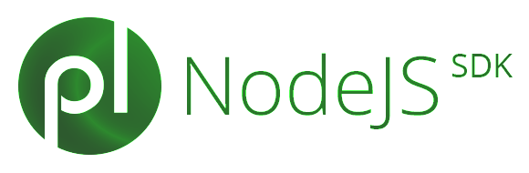
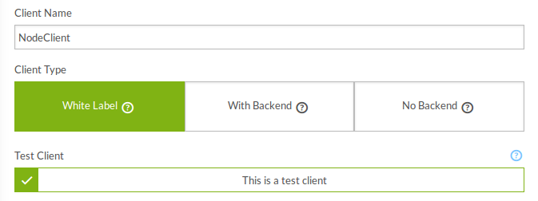
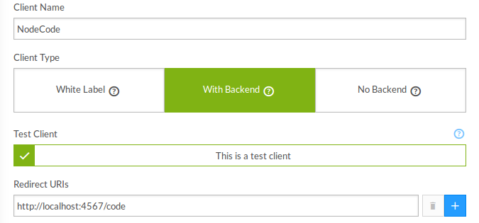

Playlyfe Node SDK [](http://badge.fury.io/js/playlyfe-node-sdk)
=================

Playlyfe API implementation in NodeJS. This module integrates seamlessly with the [passport-playlyfe](https://github.com/playlyfe/passport-playlyfe) module for authentication support.

Visit the complete [API reference](http://dev.playlyfe.com/docs/api)

To learn more about how you can build applications on Playlyfe visit the [official developer documentation](http://dev.playlyfe.com)

##Install
To get started simply run

```sh
npm install playlyfe
```

The Playlyfe class allows you to make rest api calls like GET, POST, .. etc
```js
var Playlyfe =  require('playlyfe')
var pl = new Playlyfe({
    type: 'client'
    version: 'v1',
    client_id: "Your client id",
    client_secret: "Your client secret"
});
```
You can use either promises or callbacks
***Promises***
```js
// To get infomation of the player johny
pl.get('/player',{ player_id: 'johny' }) 
.then(function(player) {
    console.log(player);
})
.catch(function() {
    console.log('Error');
});
```
***Callbacks***
```js
pl.get('/player', { player_id: 'johny' }, false, function(err, player) {
    if(err) {
     console.log('Error');
    }
    console.log(player);
});
```

## Using
### Create a client
  If you haven't created a client for your game yet just head over to [Playlyfe](http://playlyfe.com) and login into your account, and go to the game settings and click on client
  **1.Client Credentials Flow**
    In the client page click on whitelabel client
    

  **2.Authorization Code Flow**
    In the client page click on backend client and specify the redirect uri this will be the url where you will be redirected to get the token
    

And then note down the client id and client secret you will need it later for using it in the sdk

## 1. Client Credentials Flow
A typical flask app using client credentials code flow with a single route would look something like this
```js
var Playlyfe =  require('playlyfe')
var pl = new Playlyfe({
    type: 'client'
    version: 'v1',
    client_id: "Your client id",
    client_secret: "Your client secret"
});
```
## 2. Authorization Code Flow
```js
var Playlyfe =  require('playlyfe')
var pl = new Playlyfe({
    type: 'code'
    version: 'v1',
    client_id: "Your client id",
    client_secret: "Your client secret",
    redirect_uri: 'https://playlyfe.com/redirect'
});
```

# Documentation
You can initiate a client by giving the client_id and client_secret params
```js
var Playlyfe = require('playlyfe');
var pl = new Playlyfe({
    type: 'client' or 'code',
    client_id: 'Your client id',
    client_secret: 'Your client Secret',
    version: 'v1',
    redirect_uri: 'The url to redirect to', //only for auth code flow
    store: function(access_token) {
        // The function which will persist the access token to a database. You have to persist the token to a database if you want the access token to remain the same in every request
    }, 
    load: function() {
        // The function which will load the access token. This is called internally by the sdk on every request so the the access token can be persisted between requests
        //return the access_token here
    }, 
    strictSSL: true
});
```

In development the sdk caches the access token in memory so you dont need to provide the store and load functions. But in production it is highly recommended to persist the token to a database. It is very simple and easy to do it with redis. You can see the test cases for more examples.

```js
var Playlyfe = require('playlyfe');
var redis = require('ioredis');
var Promise = require('bluebird');

var pl = new Playlyfe({
    type: 'client' or 'code',
    client_id: 'Your client id',
    client_secret: 'Your client Secret',
    version: 'v1',
    store: function(access_token) {
        redis.hmset("access_token", access_token)
        Promise.resolve()
    }, 
    load: function() {
        redis.hmgetall("access_token")
        .then (access_token) ->
            Promise.resolve(access_token)
    }, 
    strictSSL: true
});
```

**API**
All these methods return a bluebird Promise if you don't pass a callback.

```js
api(method, route, query, body, raw, callback)
```
**Get**
```js
get(route, query, raw, callback)
```
**Post**
```js
post(route, query, body, callback)
```
**Patch**
```js
patch(route, query, body, callback)
```
**Put**
```js
put(route, query, body, callback)
```
**Delete**
```js
post(route, query, callback)
```
**Get Login Url**
```js
getAuthorizationURI()
//This will return the url to which the user needs to be redirected to login.
```

License
=======
Playlyfe NodeJS SDK v0.4.0  
http://dev.playlyfe.com/  
Copyright(c) 2013-2014, Playlyfe IT Solutions Pvt. Ltd, support@playlyfe.com  

Permission is hereby granted, free of charge, to any person obtaining a copy
of this software and associated documentation files (the "Software"), to deal
in the Software without restriction, including without limitation the rights
to use, copy, modify, merge, publish, distribute, sublicense, and/or sell
copies of the Software, and to permit persons to whom the Software is
furnished to do so, subject to the following conditions:

The above copyright notice and this permission notice shall be included in
all copies or substantial portions of the Software.

THE SOFTWARE IS PROVIDED "AS IS", WITHOUT WARRANTY OF ANY KIND, EXPRESS OR
IMPLIED, INCLUDING BUT NOT LIMITED TO THE WARRANTIES OF MERCHANTABILITY,
FITNESS FOR A PARTICULAR PURPOSE AND NONINFRINGEMENT. IN NO EVENT SHALL THE
AUTHORS OR COPYRIGHT HOLDERS BE LIABLE FOR ANY CLAIM, DAMAGES OR OTHER
LIABILITY, WHETHER IN AN ACTION OF CONTRACT, TORT OR OTHERWISE, ARISING FROM,
OUT OF OR IN CONNECTION WITH THE SOFTWARE OR THE USE OR OTHER DEALINGS IN
THE SOFTWARE.
